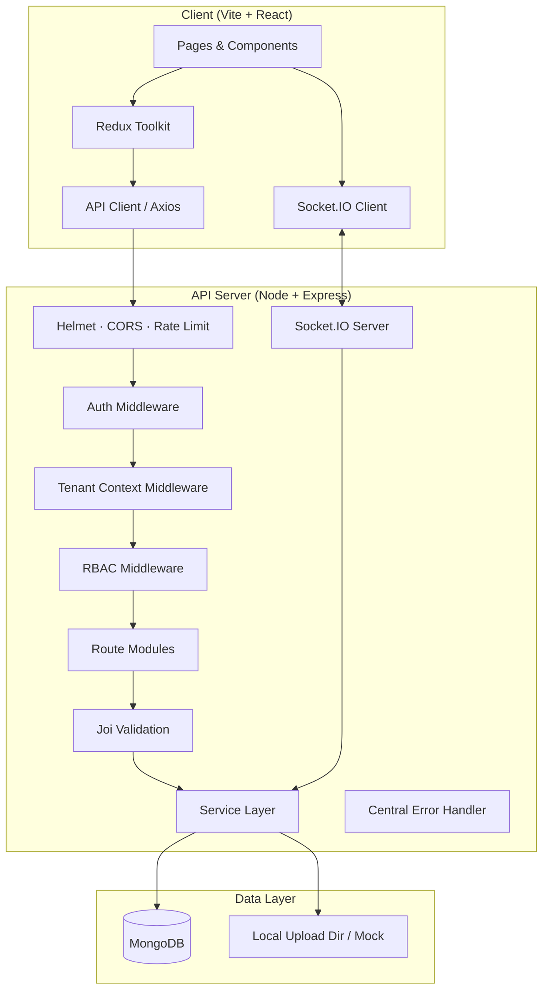
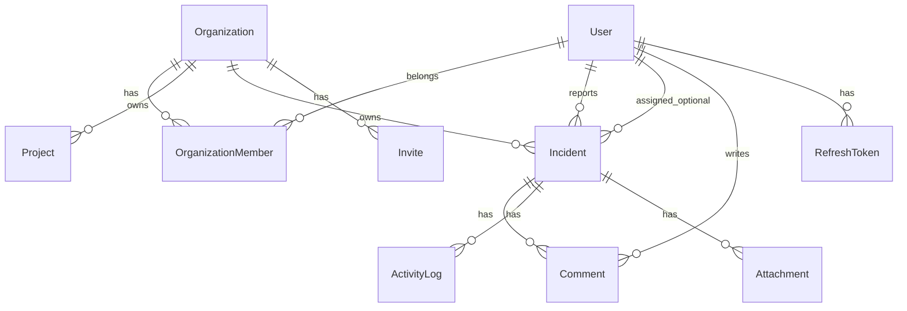
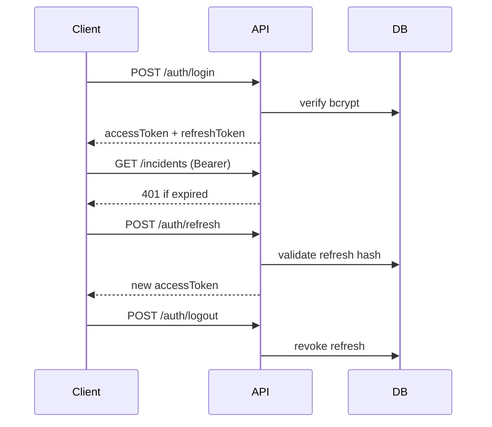

# System Design — Multi-Tenant Incident Management Platform

**Version:** 1.1  
**Stack:** Vite + React (JavaScript) · Node.js + Express (JavaScript) · MongoDB · JWT · Socket.IO/SSE · Redux Toolkit or Context API  
**Scope:** Assignment-scale SaaS (10h build target; design supports growth)

> **Language choice:** Plain **JavaScript** only — no TypeScript on frontend or backend. Validation via **Joi**; API docs via **JSDoc + Swagger**.

---

## 1. Executive Summary

A **multi-tenant** operations platform where each **organization (tenant)** has isolated users, projects, incidents, comments, activity logs, and analytics. Users may belong to multiple organizations and switch context. **RBAC** (Admin, Manager, Developer) is enforced on the API layer. **JWT + refresh tokens** secure access; **Socket.IO** (or SSE) pushes incident/comment updates in real time. **MongoDB aggregation** powers the dashboard.

### Design principles

| Principle | Application |
|-----------|-------------|
| Tenant isolation | Every business document carries `organizationId`; queries always scope by active org |
| Defense in depth | JWT → org membership → RBAC → input validation → rate limits |
| Auditability | Immutable activity timeline on every meaningful mutation |
| Assignment safety | Incidents store assignee snapshot; deleted users do not break records |
| Time-boxed delivery | Monolith API + single DB; clear module boundaries for future split |

---

## 2. High-Level Architecture



### Deployment view (assignment / free tier)

| Tier | Suggested host |
|------|----------------|
| Frontend | Vercel / Netlify |
| API + Socket.IO | Render / Railway (single process) |
| Database | MongoDB Atlas (M0) |

**Note:** Socket.IO requires sticky sessions or a single API instance on free tier; document this in README.

---

## 3. Multi-Tenancy Model

### 3.1 Strategy: **Shared database, shared collections, tenant discriminator**

Each document that belongs to an org includes `organizationId: ObjectId`. All list/detail/update/delete queries **must** include:

```js
{ organizationId: req.tenant.organizationId }
```

**Why (for this assignment):** Fast to implement, one Atlas cluster, aggregation pipelines stay simple. Acceptable for 2.5–3.5 YOE demo; document path to schema-per-tenant or DB-per-tenant if enterprise scale is needed.

### 3.2 Tenant context resolution

1. User authenticates → JWT contains `userId`, optional `activeOrganizationId`.
2. Client sends header: `X-Organization-Id: <orgId>` (or relies on JWT claim after org switch).
3. **Tenant middleware** verifies `OrganizationMember` exists for `(userId, organizationId)`.
4. `req.tenant = { organizationId, role }` attached for downstream RBAC and queries.

**Unauthorized org access:** Return `403` with standardized error body; never leak whether org exists.

### 3.3 Organization switch

- Endpoint: `POST /api/v1/organizations/:orgId/switch`
- Updates user's `lastActiveOrganizationId` and issues new access token (or updates claim).
- Frontend clears org-scoped Redux slices and refetches dashboard/incidents.

---

## 4. Domain Model & Database Design

### 4.1 Entity relationship (logical)



### 4.2 Collections & key fields

#### `users`

| Field | Type | Notes |
|-------|------|-------|
| `_id` | ObjectId | |
| `email` | string | unique, indexed |
| `passwordHash` | string | bcrypt |
| `name` | string | |
| `lastActiveOrganizationId` | ObjectId? | |
| `createdAt`, `updatedAt` | Date | |

#### `organizations`

| Field | Type | Notes |
|-------|------|-------|
| `_id` | ObjectId | tenant id |
| `name` | string | |
| `slug` | string | unique optional |
| `createdBy` | ObjectId | ref User |
| `createdAt` | Date | |

#### `organization_members`

| Field | Type | Notes |
|-------|------|-------|
| `organizationId` | ObjectId | compound index with userId |
| `userId` | ObjectId | |
| `role` | enum | `admin` \| `manager` \| `developer` |
| `joinedAt` | Date | |

**Index:** `{ organizationId: 1, userId: 1 }` unique — prevents duplicate membership.

#### `invites`

| Field | Type | Notes |
|-------|------|-------|
| `organizationId` | ObjectId | |
| `email` | string | |
| `role` | enum | |
| `token` | string | hashed or UUID |
| `invitedBy` | ObjectId | |
| `status` | enum | `pending` \| `accepted` \| `expired` |
| `expiresAt` | Date | |

**Index:** `{ organizationId: 1, email: 1, status: 1 }` — **duplicate pending invites prevented** at DB + service layer.

#### `projects` (optional but supports “projects” in brief)

| Field | Type | Notes |
|-------|------|-------|
| `organizationId` | ObjectId | |
| `name`, `description` | string | |

#### `incidents`

| Field | Type | Notes |
|-------|------|-------|
| `organizationId` | ObjectId | required on all queries |
| `projectId` | ObjectId? | |
| `title`, `description` | string | |
| `severity` | enum | `critical` \| `high` \| `medium` \| `low` |
| `status` | enum | `open` \| `in_progress` \| `resolved` \| `closed` |
| `tags` | string[] | |
| `assigneeId` | ObjectId? | nullable |
| `assigneeSnapshot` | object? | `{ id, name, email }` at assign time |
| `reporterId` | ObjectId | |
| `reporterSnapshot` | object | denormalized for timeline |
| `dueDate` | Date? | |
| `resolvedAt` | Date? | set when status → resolved/closed |
| `version` | number | optimistic concurrency |
| `createdAt`, `updatedAt` | Date | |

**Deleted assignee edge case:** Keep `assigneeId` as historical ref; UI uses `assigneeSnapshot` or label “Former user”. Listing filters by assignee use `assigneeId`; unassigned bucket when null.

#### `comments`

| Field | Type | Notes |
|-------|------|-------|
| `incidentId`, `organizationId` | ObjectId | |
| `authorId` | ObjectId | |
| `body` | string | parse `@email` mentions |
| `mentions` | ObjectId[] | resolved user ids |
| `createdAt` | Date | |

#### `activity_logs` (append-only timeline)

| Field | Type | Notes |
|-------|------|-------|
| `organizationId` | ObjectId | |
| `entityType` | string | `incident`, `comment`, `organization`, … |
| `entityId` | ObjectId | |
| `action` | string | e.g. `severity_changed`, `status_changed` |
| `actorId` | ObjectId | |
| `metadata` | object | `{ from, to, field }` |
| `message` | string | human-readable |
| `createdAt` | Date | |

**Index:** `{ organizationId: 1, entityId: 1, createdAt: -1 }`

#### `attachments`

| Field | Type | Notes |
|-------|------|-------|
| `incidentId`, `organizationId` | ObjectId | |
| `filename`, `mimeType`, `size` | | |
| `storagePath` | string | local mock |
| `uploadedBy` | ObjectId | |

#### `refresh_tokens`

| Field | Type | Notes |
|-------|------|-------|
| `userId` | ObjectId | |
| `tokenHash` | string | store hash only |
| `expiresAt` | Date | |
| `revokedAt` | Date? | logout |

---

## 5. Authentication & Session Design

### 5.1 Token strategy

| Token | Lifetime | Storage | Payload |
|-------|----------|---------|---------|
| Access JWT | 15 min | Memory (RTK) / short-lived cookie optional | `sub`, `email`, `activeOrganizationId?` |
| Refresh token | 7 days | HttpOnly cookie **or** DB + body (document choice in README) | opaque random → hashed in DB |

### 5.2 Flows



- **Signup:** create user → optionally create default org or prompt org creation.
- **Expired JWT:** API returns `401` + code `TOKEN_EXPIRED`; client interceptor calls refresh once, retries request.
- **Logout:** revoke refresh token; client clears access token and org state.

### 5.3 Password security

- bcrypt cost factor 10–12
- validate email/password strength on signup (Joi)

---

## 6. RBAC Matrix

Enforcement: **`requirePermission('incident:update')`** style middleware after tenant context.

| Permission | Admin | Manager | Developer |
|------------|:-----:|:-------:|:---------:|
| Manage org settings | ✓ | — | — |
| Invite / remove members | ✓ | ✓ | — |
| Change member roles | ✓ | — | — |
| Create / edit any incident | ✓ | ✓ | ✓ (own optional*) |
| Delete incident | ✓ | ✓ | — |
| Assign any user | ✓ | ✓ | — |
| Assign self | ✓ | ✓ | ✓ |
| View dashboard | ✓ | ✓ | ✓ |
| Comment | ✓ | ✓ | ✓ |

\*Optional rule for assignment: Developers edit incidents they reported or are assigned to; Managers/Admins edit all. Document chosen rule in README.

**Implementation:**

```js
const ROLE_PERMISSIONS = {
  admin: ['incident:create', 'incident:delete', /* ... */],
  manager: [/* ... */],
  developer: [/* ... */],
};

function hasPermission(role, permission) {
  return ROLE_PERMISSIONS[role]?.includes(permission) ?? false;
}
```

---

## 7. API Design

**Base path:** `/api/v1`  
**Response envelope:**

```json
{
  "success": true,
  "data": { },
  "meta": { "page": 1, "limit": 20, "total": 100 }
}
```

```json
{
  "success": false,
  "error": { "code": "VALIDATION_ERROR", "message": "...", "details": [] }
}
```

### 7.1 Route map

| Method | Path | Auth | RBAC | Description |
|--------|------|------|------|-------------|
| POST | `/auth/signup` | — | — | Register |
| POST | `/auth/login` | — | — | Login |
| POST | `/auth/refresh` | refresh | — | New access token |
| POST | `/auth/logout` | ✓ | — | Revoke refresh |
| GET | `/auth/me` | ✓ | — | Current user + memberships |
| POST | `/organizations` | ✓ | — | Create org (creator = admin) |
| GET | `/organizations` | ✓ | — | List user's orgs |
| POST | `/organizations/:id/switch` | ✓ | member | Set active tenant |
| POST | `/organizations/:id/invites` | ✓ | invite | Create invite |
| POST | `/invites/accept` | ✓ | — | Accept via token |
| GET | `/projects` | ✓ | tenant | List projects |
| GET | `/incidents` | ✓ | tenant | List + filters + pagination |
| POST | `/incidents` | ✓ | create | Create |
| GET | `/incidents/:id` | ✓ | tenant | Detail + timeline |
| PATCH | `/incidents/:id` | ✓ | update | Update (version check) |
| DELETE | `/incidents/:id` | ✓ | delete | Soft or hard delete |
| POST | `/incidents/:id/comments` | ✓ | comment | Add comment |
| GET | `/incidents/:id/comments` | ✓ | tenant | Paginated comments |
| POST | `/incidents/:id/attachments` | ✓ | update | Multipart upload |
| GET | `/dashboard/metrics` | ✓ | tenant | Aggregation metrics |
| GET | `/activity` | ✓ | tenant | Org or entity timeline |

### 7.2 Incident list query parameters

| Param | Validation |
|-------|------------|
| `status`, `severity` | enum arrays |
| `assigneeId` | ObjectId or `unassigned` |
| `reporterId` | ObjectId |
| `from`, `to` | ISO dates on `createdAt` or `dueDate` |
| `q` | title search (regex escaped / text index) |
| `sort` | `createdAt`, `dueDate`, `severity`, `status` |
| `order` | `asc` \| `desc` |
| `page`, `limit` | max limit 100 |

**Invalid filters → `400` with field-level errors** (mandatory edge case).

### 7.3 Optimistic concurrency

- Client sends `If-Match: <version>` or body `{ version: 3 }`.
- Update uses `findOneAndUpdate({ _id, organizationId, version }, { $set: ..., $inc: { version: 1 } })`.
- If `matchedCount === 0` → `409 CONFLICT` with latest incident in response optional.

---

## 8. Activity Timeline System

### 8.1 Pattern: **Transactional side-effect in service layer**

Every mutation funnels through services that:

1. Apply business change
2. `ActivityLog.create({ ... })` in same request (Mongo transaction if replica set; else best-effort with logging on failure)

### 8.2 Action catalog (examples)

| Action | Trigger | metadata |
|--------|---------|----------|
| `incident.created` | POST incident | `{ title }` |
| `severity_changed` | PATCH severity | `{ from, to }` |
| `status_changed` | PATCH status | `{ from, to }` |
| `assignee_changed` | PATCH assignee | `{ fromId, toId }` |
| `incident.closed` | status → closed | |
| `comment.added` | POST comment | `{ commentId }` |

Timeline API returns merged logs for incident detail page (newest first, paginated).

---

## 9. Dashboard Analytics (MongoDB Aggregation)

Single endpoint `GET /dashboard/metrics` scoped by `organizationId`.

### 9.1 Pipeline building blocks

1. **Open / closed counts:** `$match { organizationId, status }` → `$group` → `$count`
2. **By severity:** `$group { _id: '$severity', count: { $sum: 1 } }`
3. **Average resolution time:** `$match { resolvedAt: { $exists: true } }` → `$project { duration: { $subtract: ['$resolvedAt', '$createdAt'] } }` → `$group { _id: null, avg: { $avg: '$duration' } }`
4. **Most active users:** join `activity_logs` on `actorId` in last 30 days → `$group` by actor → `$sort` → `$limit 5`

Optional `$facet` to run sub-pipelines in one round trip:

```js
{ $facet: {
    openCount: [ /* ... */ ],
    closedCount: [ /* ... */ ],
    bySeverity: [ /* ... */ ],
    avgResolution: [ /* ... */ ],
    activeUsers: [ /* ... */ ]
}}
```

---

## 10. Real-Time Architecture (Socket.IO)

### 10.1 Connection auth

- Client connects with `auth: { token: accessJWT }`
- Server verifies JWT, joins room `org:<organizationId>`
- On org switch: leave old room, join new room

### 10.2 Events (server → client)

| Event | Payload | When |
|-------|---------|------|
| `incident:updated` | partial incident | status, severity, assignee PATCH |
| `incident:assigned` | `{ incidentId, assignee }` | assignment change |
| `comment:created` | comment DTO | new comment |

### 10.3 Events (client → server)

Optional `join:incident` room for detail page efficiency.

**SSE alternative:** one-way `text/event-stream` per org channel; simpler but no ack — acceptable per requirements.

---

## 11. Comments & Mentions

1. On create, parse body with regex: `@([^\s@]+@[^\s@]+\.[^\s@]+)`
2. Resolve emails to user ids **within same organization**
3. Store `mentions[]` on comment
4. Emit `comment:created` on socket
5. Log `comment.added` activity

Optional: stub notifications collection for future email.

---

## 12. File Attachments (Mock / Local)

- Multer disk storage under `uploads/<organizationId>/<incidentId>/`
- Max size / allowed MIME whitelist in config
- Serve via authenticated route or signed URL pattern
- Metadata in `attachments` collection

---

## 13. Security Architecture

| Control | Implementation |
|---------|----------------|
| Password hashing | bcrypt |
| JWT | `jsonwebtoken`, short access TTL, refresh rotation optional |
| Input validation | Joi schemas per route (request body + query) |
| NoSQL injection | `express-mongo-sanitize`, typed queries, no raw user objects in `$where` |
| Headers | `helmet()` |
| Rate limiting | `express-rate-limit` on `/auth/*` stricter than global |
| CORS | allowlist frontend origin from env |
| Secrets | `.env` — `JWT_ACCESS_SECRET`, `JWT_REFRESH_SECRET`, `MONGO_URI` |
| Uploads | sanitize filename, content-type check |

---

## 14. Frontend Architecture

### 14.0 Tooling (Vite + React, JavaScript)

- Scaffold: `npm create vite@latest client -- --template react`
- Use **`.jsx`** for components and **`.js`** for non-UI modules (store, services, hooks)
- No `typescript`, `tsconfig`, or `@types/*` dependencies
- Env: `import.meta.env.VITE_API_URL` (Vite convention)
- Optional: ESLint with `eslint-plugin-react` only

### 14.1 Structure

```
client/
  index.html
  vite.config.js
  src/
    main.jsx
    App.jsx
    app/              # router, providers
    features/
      auth/
      organizations/
      incidents/
      dashboard/
      comments/
    components/       # shared UI (.jsx)
    hooks/            # useDebounce.js, useSocket.js
    store/            # RTK slices (.js) or context/
    services/         # api.js — axios instance, interceptors
    utils/            # helpers, formatters
    constants/        # roles, statuses, routes
```

### 14.2 State management

| Slice | Responsibility |
|-------|----------------|
| `auth` | user, tokens, login/logout/refresh |
| `organization` | active org, list, switch |
| `incidents` | list filters, pagination, selected incident |
| `dashboard` | metrics cache |
| `socket` | connection status, last event |

**Debounced search:** `useDebouncedValue(q, 300)` → triggers RTK Query refetch or dispatch list thunk.

### 14.3 Routes (protected)

| Path | Screen |
|------|--------|
| `/login`, `/signup` | Public |
| `/` | Dashboard |
| `/incidents` | Listing + filters |
| `/incidents/new`, `/incidents/:id/edit` | Form |
| `/incidents/:id` | Detail + timeline + comments |
| `/settings/organization` | Org + invites |

`ProtectedRoute` checks auth; `OrgGuard` ensures active org selected.

### 14.4 API client interceptors

1. Attach `Authorization` + `X-Organization-Id`
2. On 401 `TOKEN_EXPIRED` → refresh queue → retry
3. On 403 → toast + redirect if org forbidden

---

## 15. Backend Folder Structure

### 15.0 Tooling (Node.js + Express, JavaScript)

- **CommonJS** (`require` / `module.exports`) or **ESM** (`"type": "module"` in `package.json`) — pick one and stay consistent; ESM is fine with Node 18+
- Entry: `server.js` or `src/server.js`
- No TypeScript, no build step required (run with `node` or `nodemon`)
- Validation: **Joi** (+ `celebrate` optional wrapper for Express)
- Models: **Mongoose** schemas in `.js` files

```
server/
  package.json
  .env
  src/
    config/           # env.js, db.js, cors.js
    modules/
      auth/
        auth.routes.js
        auth.controller.js
        auth.service.js
        auth.validation.js
      organizations/
      incidents/
      comments/
      dashboard/
      activity/
      uploads/
    models/           # User.js, Incident.js, ...
    middleware/
      auth.js
      tenant.js
      rbac.js
      validate.js
      errorHandler.js
    shared/
      utils/
      constants/      # permissions.js, enums.js
    sockets/
      index.js
    app.js
    server.js
```

**Layers:** `routes → controllers → services → models (Mongoose)`

**Example Joi middleware:**

```js
const validate = (schema) => (req, res, next) => {
  const { error, value } = schema.validate(
    { body: req.body, query: req.query, params: req.params },
    { abortEarly: false }
  );
  if (error) {
    return res.status(400).json({
      success: false,
      error: { code: 'VALIDATION_ERROR', details: error.details },
    });
  }
  Object.assign(req, value);
  next();
};
```

---

## 16. Cross-Cutting Concerns

### 16.1 Logging

- `pino` or `winston` — request id, userId, organizationId on each log line
- Log errors in central handler without leaking stack in production

### 16.2 Error codes (examples)

`VALIDATION_ERROR`, `UNAUTHORIZED`, `FORBIDDEN`, `NOT_FOUND`, `CONFLICT`, `TOKEN_EXPIRED`, `RATE_LIMITED`

### 16.3 Indexing checklist

- `incidents`: `{ organizationId: 1, status: 1, severity: 1, createdAt: -1 }`
- `incidents`: `{ organizationId: 1, title: 'text' }` if text search
- `organization_members`: unique compound
- `activity_logs`: `{ organizationId: 1, entityId: 1, createdAt: -1 }`

---

## 17. Mandatory Edge Cases — Design Responses

| Edge case | Design response |
|-----------|-----------------|
| Deleted assignee | `assigneeSnapshot` + nullable `assigneeId`; UI shows snapshot |
| Expired JWT | 401 + refresh interceptor; refresh token rotation |
| Duplicate invites | Unique partial index on pending `(orgId, email)`; return `409` |
| Unauthorized org | Tenant middleware membership check → `403` |
| Invalid filters | Joi on querystring → `400` with details |
| Concurrent updates | `version` field + `409` on mismatch |

---

## 18. Implementation Phasing (10h)

| Phase | Hours | Deliverable |
|-------|-------|-------------|
| 1 | 1.5 | Vite React (JS) + Express (JS) scaffold, Mongoose models, auth + refresh |
| 2 | 2 | Org CRUD, invites, tenant + RBAC middleware |
| 3 | 2.5 | Incidents CRUD, filters, attachments, activity logs |
| 4 | 1.5 | Dashboard aggregations |
| 5 | 1.5 | Socket.IO + comments |
| 6 | 1 | Frontend pages + Redux + polish |
| Buffer | — | README, Swagger, screenshots |

---

## 19. API Documentation

- **Swagger:** `swagger-ui-express` + **JSDoc** comments on route handlers (plain JS; no code-gen from types)
- Export **Postman collection** from OpenAPI for evaluators

---

## 20. Environment Variables

```env
# Server
NODE_ENV=development
PORT=5000
MONGO_URI=mongodb+srv://...
JWT_ACCESS_SECRET=
JWT_REFRESH_SECRET=
JWT_ACCESS_EXPIRES_IN=15m
JWT_REFRESH_EXPIRES_IN=7d
CLIENT_URL=http://localhost:5173
UPLOAD_MAX_MB=5
RATE_LIMIT_WINDOW_MS=900000
RATE_LIMIT_MAX=100

# Client
VITE_API_URL=http://localhost:5000/api/v1
VITE_SOCKET_URL=http://localhost:5000
```

---

## 21. Architecture Decisions Record (for README)

| Decision | Choice | Rationale |
|----------|--------|-----------|
| Language | JavaScript only (no TS) | Faster scaffold; Vite `react` template + plain Node |
| Frontend | Vite + React (.jsx) | Fast dev server, simple setup, `import.meta.env` |
| Backend | Node + Express (.js) | Direct `node`/`nodemon`; Mongoose + Joi |
| Tenancy | Shared DB + `organizationId` | Speed, simple aggregations |
| Tokens | JWT access + DB refresh | Meets spec; revocable logout |
| RBAC | Role enum per membership | Org-scoped roles differ per tenant |
| Real-time | Socket.IO | Bidirectional; fits comments + assignment |
| Concurrency | Version field | Explicit, Mongo-friendly |
| Search | Regex / text index | Sufficient for assignment scale |
| Uploads | Local disk | Spec allows mock; no S3 cost |

---

## 22. Future Enhancements (out of scope)

- Email invite delivery (SendGrid etc.)
- Soft-delete users with incident reassignment workflow
- Redis adapter for Socket.IO horizontal scale
- CQRS read models for analytics
- Audit export and SIEM integration

---

## 23. Success Criteria Mapping

| Requirement | Design section |
|-------------|----------------|
| Multi-tenant isolation | §3, §4 |
| JWT + refresh | §5 |
| RBAC | §6 |
| Incidents + attachments | §4, §7, §12 |
| Filters / pagination | §7.2 |
| Activity timeline | §8 |
| Dashboard aggregations | §9 |
| Real-time | §10 |
| Comments + @mentions | §11 |
| Security | §13 |
| Edge cases | §17 |

This document is the canonical reference for implementation and README “Architecture decisions” section.
